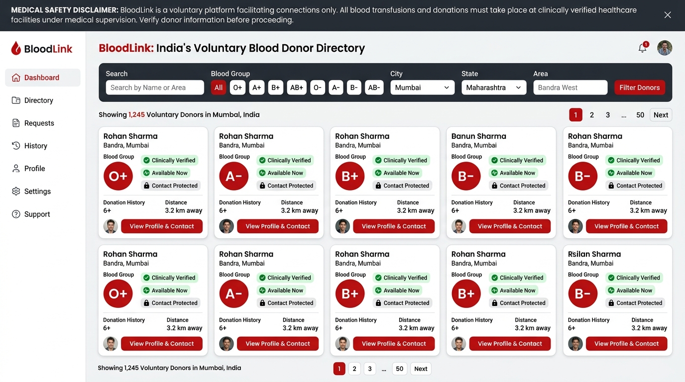
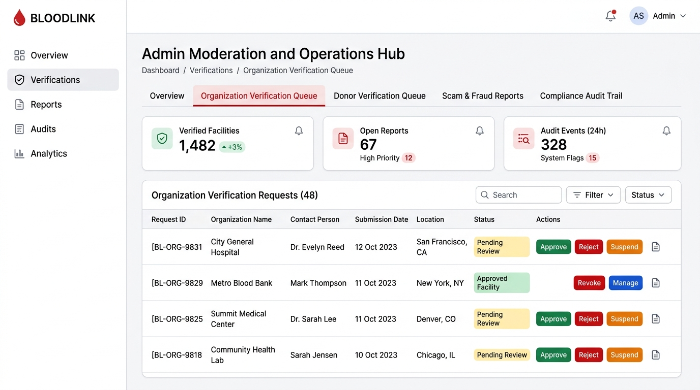

# BloodLink – Voluntary Blood Donor Platform

> ⚠️ **Demo only — not an emergency service.**  
> **Find a voluntary blood donor when every minute matters.**  
> A mobile-first, privacy-conscious voluntary blood donor directory and clinical safety platform built with Next.js App Router, TypeScript, Tailwind CSS, and Supabase PostgreSQL.

---

## 📸 Application Screenshots

| Voluntary Donor Directory Search | Healthcare Operations & Admin Hub |
| :---: | :---: |
|  |  |
| *Multi-factor ABO/Rh search with verified donor filters and zero public PII leaks.* | *Institutional verification queue, clinical audits, and trust & safety moderation.* |

---

## ⚠️ Critical Clinical Safety & Legal Disclaimer

> 🚨 **DEMO ONLY — NOT AN EMERGENCY SERVICE.**  
> **Informational Triage Only. BloodLink does not make clinical decisions, dispense medical advice, or dispatch emergency units.**  
> - Under the statutory laws of India (Directorate General of Health Services / Ministry of Health & Family Welfare and the Drugs & Cosmetics Act), every prospective transfusion requires independent ABO/Rh blood grouping, antibody screening, and laboratory crossmatching performed by certified medical officers in a licensed blood centre or hospital blood bank.  
> - Voluntary donor availability guides and algorithmic compatibility matching are provided strictly for voluntary donor triage prioritization.  
> - **In an acute medical emergency, severe hemorrhage, or trauma, contact your hospital blood bank immediately or call the national health helplines 108 / 104.**

---

## 🌟 Core User Experience & Platform Features

1. **Mobile-First Touch Ergonomics (360px+ support)**
   - Generous touch targets (min 44px on all interactive elements)
   - Sticky bottom navigation bar for comfortable one-handed mobile navigation
   - Collapsible filter drawer for instant search filtering on mobile screens

2. **Privacy by Default Architecture**
   - **Zero Public Contact Leaks:** Donor phone numbers and emails are **never exposed in public search results**.
   - Public listings display only safe attributes: display name (e.g. *Arjun K.*), blood group, city/approximate locality, verification badge, and current availability status.
   - **Explicit Two-Way Consent:** Protected contact details are only shared after a voluntary donor explicitly reviews and accepts an incoming hospital request.
   - Donors can pause their listing, export their data, or safely delete their account anytime with one click.

3. **Multi-Factor Donor Search (`/search`)**
   - Filter by all 8 ABO/Rh blood groups: **A+, A-, B+, B-, AB+, AB-, O+, O-**
   - Search by Indian state, city/district, and optional 6-digit PIN code
   - Real-time availability toggles: *Available Now*, *Temporarily Unavailable*, *Resting until Date*
   - Verified donor filters: *Phone Verified*, *Email Verified*, *Clinically Verified*
   - Loading skeletons and empty states with official blood centre resources (eRaktKosh, Red Cross, helpline 104)

4. **Interactive Donor Dashboard (`/dashboard`)**
   - Instant availability status switcher: *Available now*, *Temporarily unavailable*, *Resting until specific date*
   - Profile completeness meter (40% to 100%)
   - Real-time incoming blood request queue with status tracking: *New*, *Viewed*, *Accepted*, *Declined*, *Closed*
   - Safe contact exchange workflow once a request is accepted
   - One-click listing pause and privacy settings

5. **Broadcast Blood Requests (`/request-blood`)**
   - Request whole blood, packed red cells (PRBC), platelets, plasma (FFP), or cryoprecipitate
   - Automatically filters and matches eligible compatible donors in the chosen city
   - Urgency levels: *Standard*, *Urgent*, *Critical (with visual pulse)*
   - Confirmation screen with donor match tally and transfusion safety guidance

6. **Educational Hub**
   - **Interactive Blood Compatibility Matrix (`/blood-compatibility`):** Dynamic ABO/Rh cross-matching table, antigen/antibody biology, universal red cell donor (O-), universal recipient (AB+), and component rules.
   - **Donor Eligibility Guide (`/eligibility`):** Step-by-step interactive self-screening quiz, age (18-65), weight (>45kg), intervals (90/120 days), and temporary deferral guidelines (tattoos, travel, medications).
   - **Official Blood Banks Directory (`/blood-banks`):** Directory of licensed blood centres and hospital facilities across India.

7. **PWA Support (Progressive Web App)**
   - Full `manifest.json`, high-resolution SVG icons, theme color (`#991b1b`), and offline service worker (`public/sw.js`).
   - Install prompt banner for mobile home screen pinning.

---

## 🛡️ Production Trust, Safety & Operations Features

### 1. Real Authentication & Verification
- **Dual-Mode Authentication:** Supports traditional passwords alongside Supabase Auth Email OTP, Magic Link, and Phone OTP (SMS) verification flows ([src/app/login/page.tsx](src/app/login/page.tsx)).
- **Server-Side Verification State:** Verification state (`phone_verified`, `email_verified`) is verified and stored securely in the database (`serverDb` / Supabase auth). Client-side flags are never trusted for authorization.
- **Cooldown & Rate-Limit Safeguards:** Enforces an automated 60-second cooldown between consecutive OTP requests and maximum 3 attempts per 10 minutes to protect SMS/email budgets and prevent brute-force attacks ([src/lib/security/rate-limiter.ts](src/lib/security/rate-limiter.ts)).
- **Demo Mode Isolation:** Pre-seeded demo accounts (e.g. *Arjun Kamat*, *Priya Menon*) are prominently flagged with `is_demo: true` and a visual `Demo` badge so they can never be confused with live donors.

### 2. Healthcare Organization & Hospital Verification
- **Institutional Verification Workflow:** Hospitals, licensed blood banks, specialty clinics, Red Cross chapters, and health NGOs can register through [`/register/organization`](src/app/register/organization/page.tsx).
- **Status Lifecycle:** Organizations transition through four discrete statuses:
  - `pending`: Application submitted, awaiting administrator credential check.
  - `approved`: Verification confirmed by medical review officer. Broadcast privileges activated.
  - `rejected`: Application declined with documented rejection reason.
  - `suspended`: Facility paused due to regulatory audit or license review.
- **Strict Broadcast Permission Enforcement:** Only organizations with `approved` status are authorized to broadcast emergency blood requests. Unapproved or suspended facilities are strictly blocked by database queries and Supabase Row Level Security (RLS) policies.
- **Admin Review Queue:** Dedicated operations interface ([`/admin`](src/app/admin/page.tsx)) allows administrative medical officers to review licenses, nodal officer credentials, and decide approval/rejection with mandatory notes.

### 3. Anti-Scam & Abuse Prevention
- **Statutory Non-Commercial Policy:** Commercial buying or selling of human blood is strictly illegal under the National Blood Policy of India. Prominent scam warning banners across search, broadcast, and login pages notify users that BloodLink is 100% free and never charges fees or requests advance payments.
- **Server-Enforced Rate Limits:** Tiered token-bucket rate limiter ([src/lib/security/rate-limiter.ts](src/lib/security/rate-limiter.ts)) protecting:
  - Login attempts (max 5 per 15 min per IP)
  - OTP requests (max 3 per 10 min with 60s cooldown)
  - Blood request broadcasts (max 5 per hour)
  - Abuse reports (max 10 per day)
  - Donor contact reveals (max 10 per hour to prevent scraping)
- **Cloudflare Turnstile CAPTCHA:** Server-side verification of Turnstile challenge tokens ([src/lib/security/captcha.ts](src/lib/security/captcha.ts)). Supports official Cloudflare test pass/fail tokens and safely permits local dev/demo modes when unconfigured.
- **Abuse Reporting & Auto-Flagging:** Users can report suspicious activity (commercial selling, advance payment demands, harassment, fake profiles) on any donor, organization, or blood request ([src/components/donor/report-modal.tsx](src/components/donor/report-modal.tsx)). Targets receiving 3 or more independent reports are automatically flagged (`moderationStatus: 'flagged'`) for administrative intervention.
- **Mutual Blocking:** Donors can block abusive users (`/api/users/block`). Blocked users are automatically filtered out from public directory searches (`excludeBlockedByUser`).

### 4. Extensible Multi-Channel Notifications
- **Provider Adapters ([src/lib/notifications/adapters.ts](src/lib/notifications/adapters.ts)):** Extensible architecture supporting:
  - **Email:** Resend API integration
  - **SMS:** Twilio SMS messaging service
  - **Web Push:** Web Push with VAPID keys
- **Fail-Safe Delivery Reporting:** If provider credentials are absent, the service fails safely with an explicit `provider_not_configured` delivery status. The system **never pretends** messages were sent when providers are offline.
- **Granular Donor Preferences:** Donors can configure preferences ([`/dashboard/privacy`](src/app/dashboard/privacy/page.tsx)):
  - Toggle email, SMS, and browser push notifications independently
  - Restrict notifications to "Urgent & Critical Requests Only"
  - Configure Quiet Hours (e.g. 22:00 to 07:00) with automatic night-time mute
- **Automated Lifecycle Alerts:** Notifications triggered on request receipt, donor acceptance, decline, closure, and 14-day re-verification reminders.

### 5. Append-Only Audit Logging & Consent Tracking
- **Audit logs exclude raw PII:** All audit logs pass through a deep cryptographic sanitizer ([src/lib/audit/logger.ts](src/lib/audit/logger.ts)) that:
  - Masks email addresses (e.g., `d***s@h***.org`)
  - Masks phone numbers (e.g., `***-***-3210`)
  - Redacts passwords, auth tokens, API keys, and sensitive clinical records (`[REDACTED_SENSITIVE]`)
- **Immutable Log Trail:** Records actor, action type, role, timestamp, target entity, and safe metadata for every critical action:
  - `ORGANIZATION_REGISTERED`, `ORGANIZATION_VERIFIED`, `ORGANIZATION_REJECTED`, `ORGANIZATION_SUSPENDED`
  - `DONOR_VERIFIED`, `DONOR_VERIFICATION_REJECTED`, `DONOR_VERIFICATION_EXPIRED`
  - `REPORT_FILED`, `REPORT_RESOLVED`
  - `USER_BLOCKED`, `USER_UNBLOCKED`
  - `DONOR_CONTACT_ACCESSED`, `CONSENT_GRANTED`
  - `ACCOUNT_EXPORT_REQUESTED`, `ACCOUNT_DELETED`
- **Access Control:** Restricted via Supabase RLS and server session authorization to verified administrators.

### 6. Donor Clinical Verification & Expiry Boundaries
- **Strict Separation of Concerns:** Communication verification (email/phone confirmation) is explicitly separated from medical/clinical verification.
- **Source-Tracked Verification:** Verifications document the issuing authority:
  - Licensed Blood Centre Donor Card
  - Govt. of India e-RaktKosh ID
  - Voluntary Blood Donation Camp Certificate
  - Hospital Transfusion Medicine Letterhead
  - BloodLink Clinical Staff Audit
- **Automatic Expiry Boundary:** If a donor's `verificationExpiresAt` is in the past, their status dynamically evaluates to `expired`. Lapsed verifications are **never presented as currently verified** in public results.
- **Re-Verification Reminders:** Donors within 14 days of expiry receive automated re-verification notices.

### 7. Data Privacy, Retention, Export & Safe Deletion
- **Privacy Dashboard ([`/dashboard/privacy`](src/app/dashboard/privacy/page.tsx)):** Explains all stored data categories, purposes, public visibility, retention windows, and legal bases.
- **Machine-Readable Export:** One-click JSON data export (`/api/user/export`) downloads profile information, donation history, correction requests, and notification preferences.
- **4-Step Safe Deletion Strategy (`/api/user/delete`):**
  1. Immediately disable public directory visibility (`publicListingEnabled: false`, `moderationStatus: 'closed'`).
  2. Permanently anonymize/scrub contact details (phone, email, password hash, address).
  3. Purge transient notification preferences.
  4. Preserve only anonymized clinical cooldown audit logs according to the configured retention policy.
- **Configurable Retention Policies (`DATA_RETENTION_POLICY`):**
  - Inactive donor contact: 2 years (730 days)
  - Closed request contacts: 90 days
  - Notification delivery logs: 60 days
  - Clinical & regulatory audit trails: 2,555 days (configurable policy)
  - Anonymized tombstones: 10 years (3,650 days)
- **Disaster Recovery & Incident Runbooks:** Full operational guides available in [docs/BACKUP_AND_RECOVERY.md](docs/BACKUP_AND_RECOVERY.md) and [docs/INCIDENT_RESPONSE.md](docs/INCIDENT_RESPONSE.md).

### 8. Component-Specific Matching Rules
Transfusion medicine compatibility separated into component categories ([src/lib/compatibility.ts](src/lib/compatibility.ts)):
- **Whole Blood & Packed Red Blood Cells (PRBC):** Antigens on donor red cells must not react with antibodies in recipient plasma.
  - Universal Red Cell Donor: **O-**
  - Universal Red Cell Recipient: **AB+**
- **Fresh Frozen Plasma (FFP):** Inverted compatibility rules! Transfused plasma contains antibodies that must not bind recipient red cell antigens.
  - Universal Plasma Donor: **AB+ / AB-** (plasma lacks Anti-A and Anti-B antibodies)
  - Universal Plasma Recipient: **O+ / O-** (red cells lack A and B antigens)
- **Platelets (Apheresis & Pooled):** Prioritizes ABO-identical units as first-line, with ABO-compatible secondary options. Rh considerations flagged for females of childbearing potential.
- **Cryoprecipitate Antihemophilic Factor:** ABO-compatible units preferred; Rh matching not clinically required.
- **Authoritative Citations:** Cites DGHS Indian Ministry of Health standards, NBTC National Blood Policy, and AABB Technical Manual.

### 9. Admin Operations Hub ([`/admin`](src/app/admin/page.tsx))
- Role-based authorization (`admin` / `staff`).
- Interactive dashboard tabs:
  - **Overview:** Real-time metrics for total donors, hospitals, pending verifications, and open reports.
  - **Organization Queue:** Review hospital license numbers, nodal officers, approve with certificate notes, or reject.
  - **Donor Verification Queue:** Validate e-RaktKosh IDs, blood centre cards, approve 1-year validity, or reject.
  - **Trust & Safety Reports:** Review scam reports, commercial blood solicitations, suspend accounts, and unlist offending profiles.
  - **Compliance Audit Log:** Inspect append-only sanitized operational log entries.

### 10. Monitoring & Incident Response
- **Structured JSON Logger ([src/lib/monitoring/logger.ts](src/lib/monitoring/logger.ts)):** Context-aware server logger with automatic PII redaction and Sentry error forwarding.
- **Safe Health-Check Endpoint (`/api/health`):** Reports database connectivity latency, memory usage, and notification provider statuses without leaking secret keys or internal hostnames.
- **Incident Response Runbook:** Severity triage (P1-P4), emergency credential rotation, and containment protocols in [docs/INCIDENT_RESPONSE.md](docs/INCIDENT_RESPONSE.md).

---

## 🔑 Demo Accounts for Instant Testing

You can use the one-click demo logins on the `/login` page:

| Role | Name | Blood Group | Location | Login / Email | Password |
|---|---|---|---|---|---|
| **Demo Donor 1** | Arjun Kamat | **O+** | Mumbai (Andheri West) | `arjun.k@example.com` | `Password123!` |
| **Demo Donor 2** | Priya Menon | **A+** | Bengaluru (Koramangala) | `priya.m@example.com` | `Password123!` |
| **Demo Donor 3** | Ananya Sharma | **O-** | Bengaluru (Indiranagar) | `ananya.s@example.com` | `Password123!` |
| **Admin Officer** | Dr. K. Rao | **AB+** | Visakhapatnam (Maharanipeta) | `admin@bloodlink.org` | `AdminSecure2026!` |

---

## 📂 Project Structure

```
├── public/
│   ├── manifest.json            # PWA web manifest
│   ├── sw.js                    # Offline service worker
│   └── icons/                   # 192x192 & 512x512 SVG icons
├── supabase/
│   └── migrations/
│       ├── 20260924000001_initial_schema.sql # Core schema, profiles, requests & RLS
│       └── 20260927000001_production_trust_safety_operations.sql # Organizations, reports, preferences & RLS
├── docs/
│   ├── INCIDENT_RESPONSE.md     # Severity levels, containment & runbook
│   └── BACKUP_AND_RECOVERY.md   # RPO/RTO, retention policies & recovery procedures
├── src/
│   ├── app/
│   │   ├── layout.tsx           # SEO metadata, fonts, PWA banner, Toaster
│   │   ├── page.tsx             # Home page (hero, search, stats, how it works)
│   │   ├── admin/
│   │   │   ├── page.tsx         # Trust & safety operations hub
│   │   │   └── eligibility/page.tsx # Cooldown & policy management
│   │   ├── api/
│   │   │   ├── admin/           # Organizations, donors, reports & audit routes
│   │   │   ├── auth/            # Password, OTP send/verify, logout
│   │   │   ├── donors/          # Donor directory & verification requests
│   │   │   ├── health/          # Privacy-safe uptime & health check
│   │   │   ├── notifications/   # Notification queue & status
│   │   │   ├── organizations/   # Registration & listing
│   │   │   ├── reports/         # Abuse reporting submission
│   │   │   ├── requests/        # Blood request broadcast
│   │   │   ├── user/            # Data export, safe delete, preferences
│   │   │   └── users/block/     # User mutual blocking
│   │   ├── blood-banks/page.tsx # Official blood centre locator
│   │   ├── blood-compatibility/page.tsx # Interactive compatibility matrix
│   │   ├── dashboard/page.tsx   # Availability toggles & request matches
│   │   ├── dashboard/privacy/page.tsx # Consent controls, data export & deletion
│   │   ├── eligibility/page.tsx # Self-screening quiz & NBTC rules
│   │   ├── login/page.tsx       # Sign-in & one-click demo accounts
│   │   ├── privacy/page.tsx     # Data protection & RLS explanation
│   │   ├── register/page.tsx    # Voluntary donor registration
│   │   ├── register/organization/page.tsx # Clinical facility verification application
│   │   ├── request-blood/page.tsx # Component request broadcast form
│   │   ├── search/page.tsx      # Directory search with filters & modal
│   │   └── terms/page.tsx       # Terms of service & statutory non-commercial policy
│   ├── components/
│   │   ├── ui/                  # Button, Badge, Card, Input, Select, Modal, Skeleton
│   │   ├── layout/              # Navbar, Footer, MobileNav, SafetyDisclaimerBanner
│   │   ├── donor/               # DonorCard, DonorFilter, AvailabilityBadge, ReportModal, NotifyModal
│   │   ├── educational/         # BloodMatrix, EligibilityQuiz
│   │   └── pwa/                 # PwaInstallBanner
│   ├── lib/
│   │   ├── audit/logger.ts      # Append-only audit logger with PII masking
│   │   ├── auth/otp-store.ts    # Cryptographic OTP generator with rate limiting
│   │   ├── compatibility.ts     # Component-specific transfusion compatibility rules
│   │   ├── cooldown.ts          # 4-month cooldown calculation & policy engine
│   │   ├── donor-store.ts       # Reactive client store & demo fallback
│   │   ├── monitoring/logger.ts # Structured server JSON error logger & Sentry hook
│   │   ├── notifications/       # Resend, Twilio & Web Push notification service
│   │   ├── organizations/       # Facility verification & Zod schemas
│   │   ├── privacy/service.ts   # Data retention constants & category definitions
│   │   ├── security/            # Cloudflare Turnstile & rate limiter
│   │   ├── server-db.ts         # Server-side persistence & trust engine
│   │   └── utils.ts             # Tailwind class merge & date formatters
│   └── types/
│       └── database.ts          # Supabase & TypeScript models
└── tests/
    ├── audit-and-privacy.test.ts # PII masking, verification expiry & safe deletion
    ├── component-compatibility.test.ts # Red cells, platelets, plasma & cryoprecipitate
    ├── cooldown-enforcement.test.ts # Cooldown calculation & override tests
    ├── cooldown.test.ts         # Date calculation & interval tests
    ├── eligibility-and-cooldown.test.ts # Comprehensive cooldown suite
    ├── organization-verification.test.ts # Org registration, approval & broadcast guard
    └── security-and-scam.test.ts # Rate limiting, CAPTCHA, reports & user blocking
```

---

## 🛠️ Setup & Environment Configuration

### 1. Prerequisites
- **Node.js:** v18.18+ or v20+ (tested on Node v20.x & v24.x)
- **npm:** v9+

### 2. Quick Start (Demo Mode)
The application works immediately in **Zero-Config Demo Mode** using local persistence:
```bash
npm install
npm run dev
```
Open [http://localhost:3000](http://localhost:3000). Demo accounts can be populated with one click on the login screen.

### 3. Production Environment Variables (`.env.local`)
Copy `.env.example` to `.env.local` and configure your credentials:

```bash
cp .env.example .env.local
```

| Variable | Description | Example / Default |
|---|---|---|
| `NEXT_PUBLIC_SUPABASE_URL` | Supabase Project URL | `https://xyz.supabase.co` |
| `NEXT_PUBLIC_SUPABASE_ANON_KEY` | Public client anon key | `eyJhbGci...` |
| `SUPABASE_SERVICE_ROLE_KEY` | Server-only admin key | `eyJhbGci...` |
| `RESEND_API_KEY` | Resend transactional email API key | `re_abc123...` |
| `EMAIL_FROM` | Verified sender email address | `BloodLink <alerts@bloodlink.org>` |
| `TWILIO_ACCOUNT_SID` | Twilio Account SID | `AC_abc123...` |
| `TWILIO_AUTH_TOKEN` | Twilio Auth Token | `your_token_here` |
| `TWILIO_PHONE_NUMBER` | Twilio sending phone number | `+1234567890` |
| `NEXT_PUBLIC_TURNSTILE_SITE_KEY` | Cloudflare Turnstile public site key | `0x4AAAAAAAx...` |
| `TURNSTILE_SECRET_KEY` | Cloudflare Turnstile secret key | `0x4AAAAAAAx...` |
| `VAPID_PUBLIC_KEY` | Web Push VAPID public key | `BNx...` |
| `VAPID_PRIVATE_KEY` | Web Push VAPID private key | `abc...` |
| `NEXT_PUBLIC_SENTRY_DSN` | Sentry Error Reporting DSN | `https://xxx@sentry.io/123` |

### 4. Supabase Database Migrations
Run the migrations in order via the Supabase CLI or SQL Editor:
1. `supabase/migrations/20260924000001_initial_schema.sql`: Core tables (`profiles`, `donor_profiles`, `blood_requests`, `donor_request_matches`, views, and RLS).
2. `supabase/migrations/20260927000001_production_trust_safety_operations.sql`: Healthcare organizations, reports, user blocks, notification preferences, notifications, clinical verification columns, and updated sanitized public directory view.

---

## 🚦 Scaffolded vs. Live Capabilities

| Feature | In Demo Mode | In Cloud Production Mode |
|---|---|---|
| **Donor Directory Search** | Active (22 simulated donors) | Live Supabase `public_donor_directory` view |
| **Authentication & OTP** | Cryptographic in-memory OTP + Mock session | Supabase Auth Email/Phone OTP & Magic Links |
| **Organization Verification** | Local JSON DB review & approval | PostgreSQL `organizations` table + RLS |
| **CAPTCHA Bot Defense** | Cloudflare test tokens & dev bypass | Cloudflare Turnstile live challenge validation |
| **Email Alerts** | Simulated log (`provider_not_configured`) | Resend API transactional delivery |
| **SMS Alerts** | Simulated log (`provider_not_configured`) | Twilio API SMS dispatch |
| **Browser Push** | Fallback in-app notifications | Web Push API via VAPID service worker |
| **Audit Trails** | Append-only sanitized log in JSON storage | Supabase append-only `audit_logs` table |
| **Health Check** | Latency & local DB check | Full PostgreSQL connectivity & provider audit |

---

## 🧪 Verification & Quality Assurance

Run these commands to verify:

```bash
# 1. Run complete automated test suite (53 tests across 7 test suites)
npm test

# 2. Run TypeScript strict compiler type checking
npx tsc --noEmit

# 3. Run ESLint code quality & Next.js rules check
npm run lint

# 4. Run Next.js production Turbopack compilation
npm run build
```

---

## 📄 Documentation Links
- [Incident Response Runbook](docs/INCIDENT_RESPONSE.md)
- [Backup & Disaster Recovery Plan](docs/BACKUP_AND_RECOVERY.md)
- [Supabase Production Migration](supabase/migrations/20260927000001_production_trust_safety_operations.sql)

---

## 📜 License

This project is licensed under the MIT License — see the [LICENSE](LICENSE) file for details.

